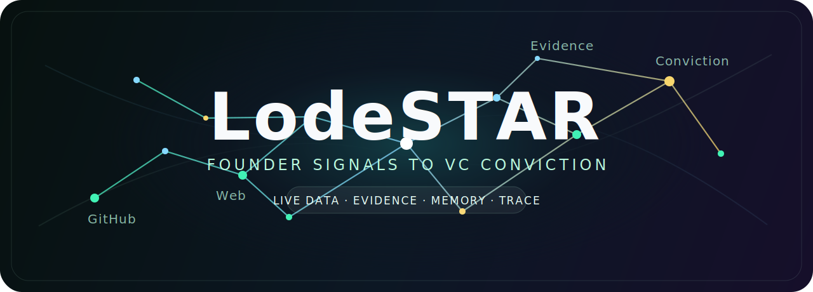
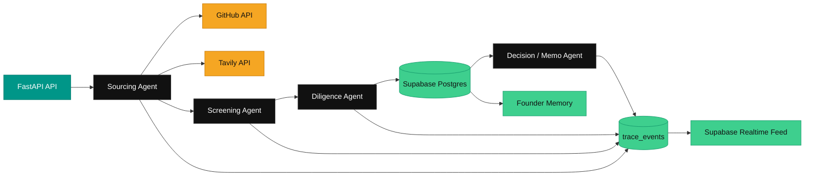

# LodeSTAR



Discover exceptional founders before they start fundraising.


LodeSTAR is a backend-first VC intelligence system for sourcing, screening, and
tracking early founder signals with evidence-backed reasoning.

This is a **hackathon project built by Team VizMinds** for the Maschmeyer Group
"VC Brain" track at Hack-Nation's 6th Global AI Hackathon.

## Team

**Team Name:** VizMinds

| Member | Role |
| --- | --- |
| Muneeb Ahmed Khan | Team Lead & Systems/Agent Architecture |
| Abdullah | Frontend Engineer & Product Design |
| Ayna Khan | Backend Engineer - Data & Integrations Lead |

## Problem Statement

Capital often flows to founders who are already visible through networks,
introductions, and fundraising channels. Strong builders may leave signals
across GitHub repositories, product launches, hackathons, technical writing, and
open-web activity long before they ever prepare a deck.

Investors need a system that can find those signals early, assess them with
traceable reasoning, and flag uncertainty instead of filling gaps with guesses.

## Hackathon Pitch

**LodeSTAR is an evidence-backed VC brain for discovering and evaluating
founders before they formally fundraise.**

The one-line pitch:

```text
LodeSTAR turns live founder signals into traceable investment intelligence.
```

## Our Solution

LodeSTAR combines a FastAPI backend, live sourcing integrations, structured LLM
reasoning, and Supabase persistence.

The backend provides:

- Outbound sourcing from real GitHub and Tavily API results.
- Inbound text intake through the same founder schema.
- Voice transcript intake through the same founder schema.
- Three independent screening axes: founder, market, and idea-vs-market.
- Per-claim evidence and trust scores.
- Persistent founder memory keyed by stable identity.
- Trace events written to Supabase for the live reasoning feed.
- Evidence-backed memo generation from persisted scores and citations.

## How It Works

1. A sourcing run starts from an inbound application, voice transcript, or
   outbound GitHub/Tavily query.
2. The sourcing agent normalizes real API evidence into a shared founder schema.
3. The screening agent scores founder, market, and idea-vs-market independently.
4. The diligence agent reviews claims, trust scores, contradictions, and gaps.
5. Founder records, scores, evidence, and trace events are written to Supabase.
6. The decision agent generates an investment memo backed by stored evidence.
7. The frontend can subscribe to Supabase Realtime for live reasoning updates.

## Tech Stack

| Layer | Technology |
| --- | --- |
| Backend | Python, FastAPI, Pydantic |
| Agent Pipeline | LangGraph-compatible agent stages |
| LLM Reasoning | OpenAI |
| Founder Signals | GitHub API |
| Web Sourcing | Tavily API |
| Data Store | Supabase Postgres |
| Realtime Feed | Supabase Realtime on `trace_events` |
| Voice Path | ElevenLabs transcript/voice integration path |
| Deployment Target | Vercel Python runtime |

## Architecture



## What Is Needed

To run the backend locally, you need:

- Python 3.10+.
- A Supabase project with the schema in `docs/data-model.sql`.
- OpenAI API key.
- Tavily API key.
- Supabase project URL.
- Supabase service role or secret key.
- GitHub token for higher API limits.

Optional:

- ElevenLabs API key for voice intake and audio briefing paths.

## Repository Structure

```text
LodeSTAR/
|-- backend/              FastAPI backend, agents, integrations, API routes
|-- docs/data-model.sql   Supabase schema for founders, evidence, scores, traces
|-- README.md             Project setup, architecture, and demo instructions
|-- BUILD_BRIEF.md        Hackathon build brief and working rules
```

## Backend Agents

| Agent | File | Main Function |
| --- | --- | --- |
| Sourcing Agent | `backend/app/agents/sourcing_agent.py` | Normalizes GitHub, Tavily, inbound text, and voice transcript evidence into founder profiles. |
| Screening Agent | `backend/app/agents/screening_agent.py` | Produces independent founder, market, and idea-vs-market scores. |
| Diligence Agent | `backend/app/agents/diligence_agent.py` | Reviews trust scores, unsupported claims, contradictions, and explicit gaps. |
| Memo Agent | `backend/app/agents/memo_agent.py` | Generates the evidence-backed investment memo. |
| Pipeline | `backend/app/agents/graph.py` | Orchestrates source, screen, diligence, persistence, and trace writes. |

## API Endpoints

| Endpoint | Purpose |
| --- | --- |
| `GET /health` | Shows backend readiness and missing runtime keys. |
| `POST /api/source/outbound` | Runs live GitHub/Tavily sourcing and shared screening pipeline. |
| `POST /api/source/inbound` | Parses a real inbound text application and runs the shared pipeline. |
| `POST /api/voice/transcript` | Parses a real voice transcript and runs the shared pipeline. |
| `POST /api/screen` | Reruns three-axis screening for an existing founder. |
| `POST /api/diligence` | Reruns diligence and trust review for an existing founder. |
| `POST /api/decision` | Generates an evidence-backed memo for an existing founder. |
| `GET /api/founders` | Lists persisted founders. |
| `GET /api/founders/{founder_id}` | Returns founder profile, evidence, and scores. |

## Supabase Tables

| Table | Purpose |
| --- | --- |
| `founders` | Persistent founder memory keyed by identity. |
| `evidence` | Per-claim evidence, source snippets, and trust scores. |
| `scores` | Independent axis scores and rationales. |
| `trace_events` | Live reasoning feed events for every agent step. |

## Local Setup

### 1. Python Environment

From the project root:

```powershell
cd backend
python -m venv .venv
.\.venv\Scripts\activate
pip install -r requirements.txt
```

### 2. Backend Environment

Create a local env file from the example:

```powershell
Copy-Item .env.example .env
```

Fill in your own keys in `backend/.env` only. Do not commit real secrets.

Important variables:

```text
OPENAI_API_KEY=...
TAVILY_API_KEY=...
GITHUB_TOKEN=...
SUPABASE_URL=...
SUPABASE_SERVICE_ROLE_KEY=...
FRONTEND_ORIGIN=http://localhost:5173
OPENAI_MODEL=gpt-4.1
```

Optional:

```text
ELEVENLABS_API_KEY=...
```

### 3. Supabase Setup

In the Supabase dashboard:

1. Open SQL Editor.
2. Run `docs/data-model.sql`.
3. Enable RLS on `founders`, `evidence`, `scores`, and `trace_events`.
4. Add frontend read policies for those tables.
5. Enable Realtime for `trace_events`.
6. Enable Realtime for `founders`.

Use the service role or secret key only in the backend.

### 4. Start Backend

From `backend/`:

```powershell
.\.venv\Scripts\python.exe -m uvicorn app.main:app --reload --port 8000
```

Open:

```text
http://localhost:8000
http://localhost:8000/health
http://localhost:8000/docs
```

## Demo Test Scenarios

### Scenario 1: Backend Health

Open:

```text
http://localhost:8000/health
```

Expected result:

- `status` is `ok` when required keys are configured.
- Missing integrations are listed explicitly when setup is incomplete.

### Scenario 2: Integration Check

From `backend/`:

```powershell
.\.venv\Scripts\python.exe scripts\check_integrations.py
```

Expected result:

- GitHub, Tavily, OpenAI, and Supabase report `ok`.
- ElevenLabs may remain disconnected until voice credits or permissions are fixed.

### Scenario 3: Live Outbound Smoke Test

From `backend/`:

```powershell
.\.venv\Scripts\python.exe scripts\smoke_outbound.py
```

Expected result:

- A real GitHub/Tavily/OpenAI/Supabase pipeline run completes.
- One real founder candidate is written to Supabase.
- Trace events are written for the run.

### Scenario 4: Memo Generation

Use `GET /api/founders` to get a founder ID, then call:

```text
POST /api/decision
```

Expected result:

- Memo sections are generated from persisted evidence and scores.
- Missing facts appear as explicit gaps.

## API Test Example

PowerShell example:

```powershell
$body = @{
  thesis = @{
    sectors = @("AI infrastructure")
    stage = "pre-seed"
    geography = @("global")
    risk_appetite = "high"
  }
  github_query = "topic:ai language:Python stars:>1000"
  tavily_query = "AI infrastructure founder GitHub product launch"
  limit = 1
} | ConvertTo-Json -Depth 8

Invoke-RestMethod `
  -Uri http://localhost:8000/api/source/outbound `
  -Method Post `
  -ContentType "application/json" `
  -Body $body
```

## Vercel Backend Deployment

When deployment is requested:

1. In Vercel, import `mak4x13/LODESTAR`.
2. Create a backend project.
3. Set root directory to `backend/`.
4. Set framework preset to `Other`.
5. Add backend environment variables.
6. Deploy.
7. Confirm `/health` returns `status: ok`.

## Security Notes

- Never commit `backend/.env`.
- Never expose `SUPABASE_SERVICE_ROLE_KEY` in frontend code.
- Frontend should use only the Supabase anon or publishable key.
- Backend routes do not return mock founder, score, evidence, or memo data.
- Missing integrations return setup errors instead of fake data.
- RLS should remain enabled for tables exposed through Supabase APIs.

## Current Status

Implemented:

- FastAPI backend
- Supabase data model
- GitHub sourcing integration
- Tavily sourcing integration
- OpenAI structured reasoning
- Supabase persistence
- Three-axis screening
- Diligence and trust review
- Evidence-backed memo endpoint
- Trace event writes for live reasoning feed
- Backend smoke scripts
- Vercel backend config

Known limitations:

- ElevenLabs voice path is not required for the core backend and can wait until
  credits or permissions are fixed.
- Frontend implementation is handled separately.
- Deployment is intentionally not completed yet.
