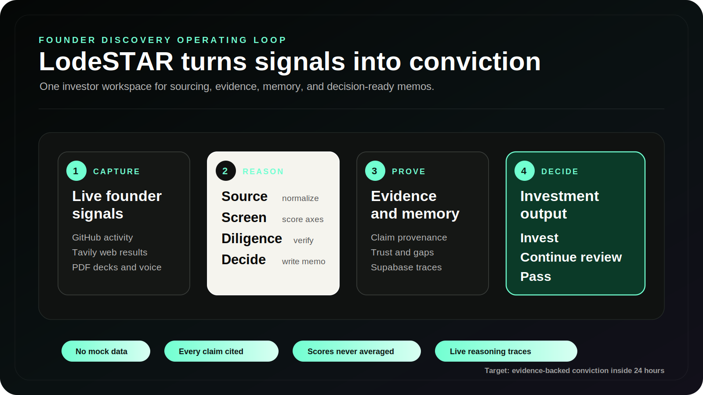

# LodeSTAR


**Discover exceptional founders before they start fundraising.**


LodeSTAR is an AI-first investor workspace built by Team VizMinds for the Maschmeyer Group "VC Brain" challenge at Hack-Nation's 6th Global AI Hackathon.

It helps a solo investor discover technical founders before they begin fundraising, test each opportunity against a configurable investment thesis, and produce an evidence-backed decision memo within 24 hours.

## Team VizMinds

<table>
  <thead>
    <tr><th align="left">Member</th><th align="left">Role</th></tr>
  </thead>
  <tbody>
    <tr><td><strong>Muneeb Ahmed Khan</strong></td><td>Team Lead and Systems/Agent Architecture</td></tr>
    <tr><td><strong>Abdullah</strong></td><td>Frontend Engineer and Product Design</td></tr>
    <tr><td><strong>Ayna Khan</strong></td><td>Backend Engineer, Data and Integrations Lead</td></tr>
  </tbody>
</table>

## Product

- **Thesis Engine** configures sector, stage, geography, check size, ownership target, and risk appetite.
- **Outbound Sourcing** translates a natural-language mandate into live GitHub and independent Tavily founder discovery.
- **Inbound Intake** sends PDF pitch decks and voice transcripts through the same pipeline.
- **Three-Axis Screening** scores Founder, Market, and Idea vs. Market independently.
- **Evidence Ledger** stores claim provenance, source snippets, trust scores, and explicit gaps.
- **Contradiction Register** preserves mutually inconsistent founder claims for investor review.
- **Live Reasoning Feed** streams agent trace events through Supabase Realtime.
- **Founder Memory** persists profiles and score trends across runs.
- **Investment Memo** generates five required decision sections with evidence references.
- **Decision Outcome** returns Invest, Continue diligence, or Pass with conditions and elapsed time against the 24-hour target.

The running application does not use fake founders, evidence, scores, or memos. Missing integrations return an explicit setup or provider error.

## Architecture



The architecture is built around one rule: every recommendation must trace back
to live evidence. GitHub, Tavily, uploaded decks, and voice transcripts all enter
the same agent pipeline, then land in Supabase as durable founder memory,
evidence, scores, contradictions, and live trace events.

```text
frontend/                 React, Vite, TypeScript, Tailwind CSS
  src/pages/              Dashboard, founder profile, founder intake
  src/components/         Thesis, pipeline, evidence, and live trace UI
  src/lib/                API, Supabase, thesis, and display helpers

backend/                  FastAPI and agent pipeline
  app/api/                REST endpoints
  app/agents/             Sourcing, screening, diligence, memo pipeline
  app/integrations/       GitHub, Tavily, OpenAI, Supabase, ElevenLabs
  app/schemas/            Request and domain models

docs/data-model.sql       Supabase schema and indexes
DESIGN.md                 Nike-inspired product design reference
BUILD_BRIEF.md            Hackathon challenge and implementation brief
```

## Local Setup

After pulling new changes, refresh both dependency sets:

```powershell
cd backend
.\.venv\Scripts\python.exe -m pip install -r requirements.txt

cd ..\frontend
npm install
```

### 1. Supabase

1. Create a Supabase project.
2. Run `docs/data-model.sql` in the SQL editor.
   Existing projects should also run `docs/migration-contradictions.sql`.
3. Enable RLS and frontend read policies for the exposed tables.
4. Enable Realtime replication for `public.trace_events` and `public.founders`.
5. Copy the project URL, anon key, and service role key.

Never expose the service role key in the frontend.

### 2. Backend

```powershell
cd backend
python -m venv .venv
.\.venv\Scripts\Activate.ps1
pip install -r requirements.txt
Copy-Item .env.example .env
```

Fill the values in `backend/.env`, then start the API:

```powershell
python -m uvicorn app.main:app --host 127.0.0.1 --port 8000
```

Required backend values:

```env
OPENAI_API_KEY=
TAVILY_API_KEY=
SUPABASE_URL=
SUPABASE_SERVICE_ROLE_KEY=
```

`GITHUB_TOKEN` is recommended for higher API limits. For voice, set `ELEVENLABS_API_KEY` and `ELEVENLABS_AGENT_ID`. Create a private ElevenLabs Agent that interviews founders about their identity, problem, product, market, execution evidence, traction, funding, and unknowns. The backend exchanges the private API key for a short-lived signed URL; the key is never sent to the browser. Transcript intake remains available through `/api/voice/transcript`.

Recommended ElevenLabs Agent system prompt:

```text
You are LodeSTAR's founder interviewer. Help a founder explain their potential even if they have no deck, funding, network, or public track record. Ask one concise question at a time. Establish the founder's name and company, the problem and urgency, product and workflow, target user and market, execution evidence, traction and KPIs, team history, funding status, risks, and what remains unknown. Probe claims for concrete examples and numbers without inventing facts. End with a short factual recap and ask the founder to correct it. Never promise funding or make the investment decision.
```

### 3. Frontend

```powershell
cd frontend
npm install
Copy-Item .env.example .env
npm run dev -- --host 127.0.0.1
```

Fill `frontend/.env` with:

```env
VITE_API_BASE_URL=http://127.0.0.1:8000
VITE_SUPABASE_URL=https://YOUR_PROJECT_REF.supabase.co
VITE_SUPABASE_ANON_KEY=YOUR_ANON_OR_PUBLISHABLE_KEY
```

Open `http://127.0.0.1:5173`.

## Demo Flow

1. Define the investment thesis and a natural-language founder mandate.
2. Scan GitHub and the open web; watch the latest Decision Stream events.
3. Open a founder to inspect three independent scores, evidence trust, contradictions, and gaps.
4. Challenge the evidence or recalculate conviction and review the visible run results.
5. Generate an Invest / Continue diligence / Pass memo with conditions and 24-hour timing.
6. Demonstrate both PDF pitch-deck intake and the ElevenLabs voice interview.

## API

| Method | Endpoint | Purpose |
| --- | --- | --- |
| `GET` | `/health` | Configuration readiness |
| `GET` | `/api/founders` | Founder memory |
| `GET` | `/api/founders/{id}` | Profile, evidence, and scores |
| `POST` | `/api/source/outbound` | GitHub and Tavily sourcing pipeline |
| `POST` | `/api/source/mandate` | Natural-language GitHub + web founder discovery |
| `POST` | `/api/source/inbound` | Written application pipeline |
| `POST` | `/api/source/inbound/deck` | PDF pitch-deck evaluation pipeline |
| `POST` | `/api/voice/transcript` | Voice transcript pipeline |
| `POST` | `/api/voice/session` | Private ElevenLabs interview session |
| `POST` | `/api/screen` | Re-run three-axis screening |
| `POST` | `/api/diligence` | Re-run evidence review |
| `POST` | `/api/decision` | Generate investment memo |

Interactive API documentation is available locally at `http://127.0.0.1:8000/docs`.

## Verification

```powershell
cd frontend
npm run build

cd ..\backend
python -m compileall -q app
python scripts/check_integrations.py
```

The integration check performs live API calls and may consume a small amount of provider quota. GitHub Actions runs the frontend build and backend compilation on every push and pull request.

## Current Readiness

- Core backend pipeline is live against GitHub, Tavily, OpenAI, and Supabase.
- Frontend dependencies install and the Vite production build passes.
- ElevenLabs is optional for the core demo and can remain disconnected until
  credits or provider-side access are fixed.
- Deployment is intentionally left for the final release step.
